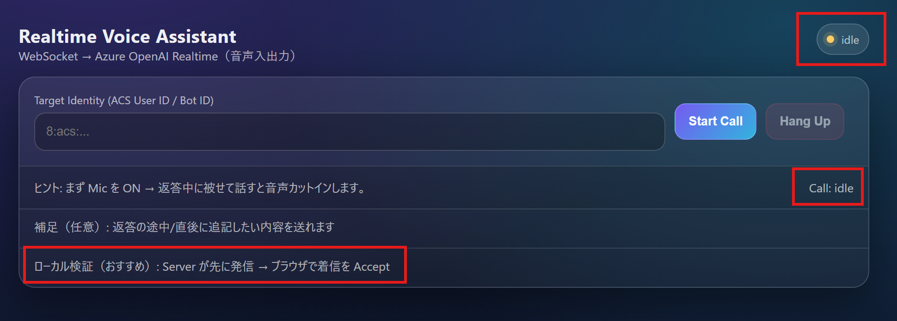
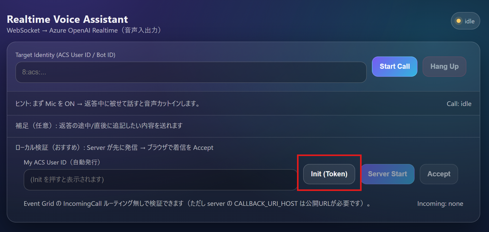
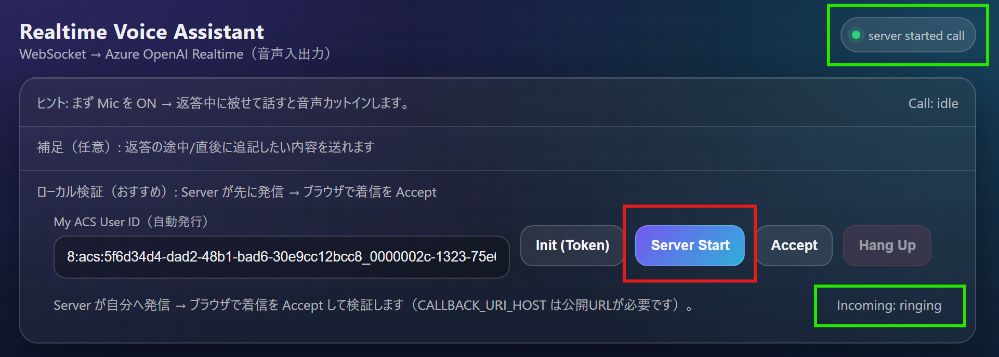
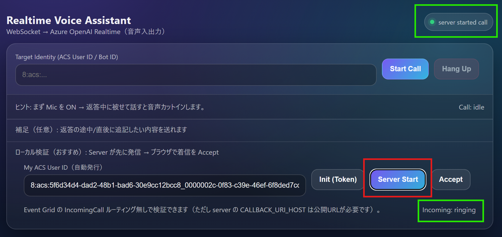
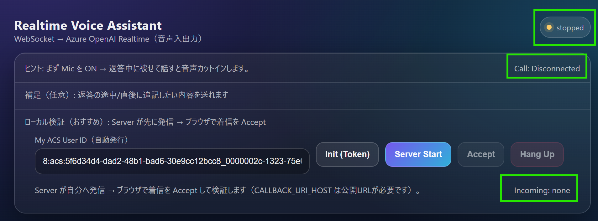

# 環境の作り方

以下はLinuxで動作確認済みです。Windowsでも同様ですが、環境変数の設定構文の違いは適宜環境に合わせてください。

## 1. 環境変数

サーバー側の環境変数は `server/.env` にまとめて管理するのを推奨します（秘密情報をシェルスクリプトに直書きしない）。

補足: このリポジトリの起動スクリプトは Python 仮想環境を `server/.venv` に統一して使います。

1. ひな形をコピー

```bash
cd server
cp .env.example .env
```

2. `server/.env` を編集して値を設定

設定する環境変数は以下です（`server/.env` は `KEY=value` 形式）：

```dotenv
AZURE_COMMUNICATION_CONNECTION_STRING=<ACSの接続文字列>
AZURE_OPENAI_ENDPOINT=<AOAIのEndpoint【例】wss://xxx.openai.azure.com>
AZURE_OPENAI_DEPLOYMENT=<AOAIのデプロイメント名【例】gpt-realtime>
AZURE_OPENAI_API_KEY=<AOAIのAPIキー。Entra ID認証実行時には不要>
AOAI_VOICE=<応答に使う音声。現在sageを指定>

# （任意）AOAI の system prompt / instructions（長い場合はファイル推奨）
# AOAI_INSTRUCTIONS_FILE=./prompts/aoai_instructions.txt
# AOAI_INSTRUCTIONS=あなたは...

# サーバーのパブリックURL（ACS から到達できる必要あり）
CALLBACK_URI_HOST=https://my-server.example

# （任意）音質改善: リサンプリング品質 (soxr)
MEDIA_WS_SOXR_QUALITY=VHQ
```

注意:

- `.env` はコミットしないでください（このリポジトリでは `.gitignore` で除外しています）。
- もし過去にキー/接続文字列をコミットしてしまっている場合は、ACS/AOAI 側でキーをローテーションしてください。

設定確認:

- サーバー起動後に `http://localhost:8000/api/health` を開くと、環境変数が読み込めているか（秘密情報は表示しない）を確認できます。

### ローカルPCで動かす場合の注意（重要）

ACS Call Automation は、

- Callback URL（`/api/callbacks`）
- Media Streaming の WebSocket（`/ws/media`）

に **Azure 側から到達できる必要**があります。ローカルPCでそのまま `http://localhost:8000` を指定しても、ACS からは到達できません。

そのためローカル検証では、`ngrok` や `cloudflared` 、`devtunnel` などで **https:// の公開URL**を作り、`CALLBACK_URI_HOST` に設定してください。

例（cloudflared）:

```bash
# 8000 を外部公開 (https://xxxx.trycloudflare.com が発行されます)
cloudflared tunnel --url http://localhost:8000

# 生成された https://xxxx.trycloudflare.com を server/.env の CALLBACK_URI_HOST に設定
```

例（Microsoft Dev Tunnels / devtunnel CLI）:

Dev Tunnels は Microsoft の開発用トンネルで、ローカルの HTTP/WS を外部から `https://...devtunnels.ms` / `wss://...devtunnels.ms` 経由で到達させることができます。

1. devtunnel CLI をインストール（Linux）

> [開発トンネルを作成してホストする](https://learn.microsoft.com/ja-jp/azure/developer/dev-tunnels/get-started) を参照

```bash
curl -sL https://aka.ms/DevTunnelCliInstall | bash
```

2. ログイン

```bash
devtunnel user login
```

3. トンネル作成（ACS から到達できる必要があるので匿名アクセス許可が必要になるケースが多い）

```bash
devtunnel create --allow-anonymous
# port create 自体には "public" などのフラグはありません（CLIの access 管理で許可します）
devtunnel port create --port-number 8000 --protocol http

# 匿名アクセスを明示的に許可（これを入れないと 401 になることがあります）
devtunnel access create --anonymous --port-number 8000

devtunnel host
```

補足: すでに作ったトンネルで 401 が返る場合は、以下で現在のアクセス設定を確認できます。

```bash
devtunnel access list
```

4. `devtunnel host` の出力に表示される `https://<tunnelId>-8000.<region>.devtunnels.ms` のような URL を、`server/.env` の `CALLBACK_URI_HOST` に設定

初回は「Connect via browser」URL をブラウザで開いて **Continue** を押して有効化が必要な場合があります（エラー画面が出ても無視して OK です）。

### WebSocket 到達性チェック（重要）

`CallConnected` 直後に `Microsoft.Communication.MediaStreamingFailed` が出て `initialWebSocketConnectionFailed` になる場合、
ほぼ確実に **ACS から `wss://.../ws/media` に接続できていません**。

まずは「外部から見て WebSocket が通るか」を確認してください（HTTP/HTTPS が開けても WebSocket が通らないケースがあります）。

- Node で簡易チェック（推奨）

```bash
npx wscat -c wss://<public-host>/ws/media
```

接続が維持できれば OK です（この `/ws/media` は疎通確認用に `pong` を返しません）。

- Python で簡易チェック（リポジトリ内スクリプト）

```bash
python server/scripts/ws_probe.py --url https://<public-host> --path /ws/media
```

これがタイムアウトする場合、ACS も同様に失敗します。その場合は以下を見直してください。

- devtunnel の匿名アクセス許可（`devtunnel access create --anonymous --port-number 8000`）
- `devtunnel host` が動き続けているか（アイドルで落ちていないか）
- 別のトンネル（`ngrok http 8000` / `cloudflared tunnel --url http://localhost:8000`）に切り替えて再検証

#### （おすすめ）1つの公開ポートだけで動かす（統合ゲートウェイ）

このリポジトリには **「公開ポートは 8000 だけ」** にして、

- HTTP（`/api/...`）は内部 FastAPI へ
- Media Streaming の WebSocket（`/ws/media`）はゲートウェイ自身で処理

ルーティングする **統合ゲートウェイ**が入っています。

1. 統合ゲートウェイを起動

```bash
./startup_server.sh
```

これで **トンネル公開は 8000 だけ**で済みます。

補足: 依存関係は `uv` がある場合は `uv sync --frozen`、無い場合は `pip install -r server/requirements.txt` で導入します（起動スクリプト内で自動判定）。

## 3 検証: Server が先に発信 → ブラウザで着信 Accept

Web UI から自分の `userId` を作って、サーバーに「自分へ発信」させる方式で検証できます。
この方式で、ACS + Media Streaming の経路を確認できます（ただし **公開URLは必須**です）。

  > ※ Web UI はローカル検証（Server Start→Accept）のみ対応しています。

### 1. サーバーを起動（`CALLBACK_URI_HOST` は上記の通り公開URLにする）

> このプロジェクトの `server/` は **Python 3.12 以上が前提**です（`server/pyproject.toml` の `requires-python = ">=3.12"`）。
> ローカルに Python 3.12 が無い場合は、`uv` を使うのが簡単です（`uv venv --python 3.12`）。

### 2. `startup_server.sh` を実行

```bash
./startup_server.sh
```

補足：手元の `python3` が 3.9 でも、`startup_server.sh` は `server/.venv/bin/python`（3.12）で起動します。

ローカルの静的チェックを 3.12 でやる場合：

```bash
cd server && ./.venv/bin/python -m compileall -q .
```

### 3. `startup_web.sh` を実行

```bash
./startup_web.sh
```

### （補足）localhost ではなくローカル IP で Web UI を開く

別PC/スマホ等から同一LAN内で Web UI を開きたい場合、`http://localhost:5173` ではなく
`http://<このPCのIP>:5173`（例: `http://172.16.0.10:5173`）でアクセスします。

ポイントは2つです。

1) Vite 開発サーバーを LAN から見えるように起動する

`startup_web.sh` は通常どおり使えますが、Vite は既定で localhost バインドのことがあるため、
必要に応じて `--host 0.0.0.0` を付けて起動してください。

```bash
cd web
npm run dev -- --host 0.0.0.0 --port 5173
```

その後、別端末のブラウザで `http://<このPCのIP>:5173` を開きます。

2) `/api/token` が失敗する場合は「API の向き先」を確認する

このリポジトリは Vite の proxy により、Web UI からの `/api/*` アクセスを
同じPC上の `http://localhost:8000`（サーバー）へ中継します。

- Web UI を `http://<このPCのIP>:5173` で開く場合も、基本は **`VITE_API_BASE` を未設定**にして
  **Vite proxy 経由**で `/api/token` を呼ぶのが安全です（CORS 回避）。
- もし `web/.env.local` 等で `VITE_API_BASE=http://localhost:8000` を設定していると、
  **別端末からアクセスした場合に「別端末自身の localhost」** を参照してしまい `token error` になります。
  この場合は `VITE_API_BASE` を削除するか、どうしても直指定したい場合は
  `VITE_API_BASE=http://<このPCのIP>:8000` にしてください。

注意: `VITE_API_BASE` で別オリジン（例: `http://<IP>:8000`）へ直接アクセスする場合、
ブラウザの CORS 制約により FastAPI 側に CORS 設定が必要になることがあります。
ローカル検証では **Vite proxy を使う（= `VITE_API_BASE` 未設定）** のが一番トラブルが少ないです。

補足（重要）:
- ここで説明している「ローカルIPで UI を開く」は、あくまで **LAN内のブラウザ表示**の話です。
  ACS の Callback / Media Streaming は Azure から到達できる必要があるため、
  `CALLBACK_URI_HOST` は引き続き `devtunnel/ngrok/cloudflared` などで作った **https の公開URL**を使ってください。

### 4. UI を開く

- ブラウザで http://localhost:5173 を開き、一番下の【ローカル検証】をクリックする。これにより、ユーザーIDが自動生成される。右上の【idle】【Call: idle】を確認する。



### 5. 初期化

- 【Init (Token)】をクリックして、ACS User IDを自動発行させる。クリックすると、IDが現れ、【Server Start】のボタンがクリックできるようになる。右上の【agent ready】も確認しておく。



### 6. サーバーの開始

- 【Server Start】をクリックして、PythonベースのサーバーからACSに接続する。右上の【server started call】と右下の【Incoming: ringing】を確認する。



> ⚠ 【Incoming: ringing】に遷移しない場合は、再度【Server Start】をクリックすると遷移します。

### 7. 通話開始

- 【Accept】をクリックしてACSと接続、通話を開始する。
- 最初はブラウザからマイク利用の許可を尋ねてくるので許可が必要。これでAI音声が返ってくるはず。



### 8. 通話終了

- 【Hang Up】をクリックすると、通話を終了できる。
- 通話が終了すると、右上のステータスが【stopped】【Call: Disconnected】に変わり、右下の着信ステータスは【Incoming: none】に変わる。



## 4. Web UI を Docker イメージで起動 (non-root)

`web/` は Vite でビルドした静的ファイルを Nginx で配信。

```bash
cd web
docker build -t aoai-realtime-web:nonroot .
docker run --rm -p 8080:8080 aoai-realtime-web:nonroot
```

- ブラウザ: `http://localhost:8080/`


## 5. Server を Docker イメージで起動（non-root）

`server/` の Dockerfile は non-root ユーザーで FastAPI(Uvicorn) を起動する

```bash
cd server
docker build -t aoai-realtime-server:nonroot .

# 必要な環境変数を渡して起動（値は自分の環境に合わせて設定）
docker run --rm -p 8000:8000 \
  -e AZURE_COMMUNICATION_CONNECTION_STRING=... \
  -e AZURE_OPENAI_ENDPOINT=... \
  -e AZURE_OPENAI_DEPLOYMENT=... \
  -e AZURE_OPENAI_API_KEY=... \
  -e AOAI_VOICE=... \
  -e CALLBACK_URI_HOST=... \
  aoai-realtime-server:nonroot
```